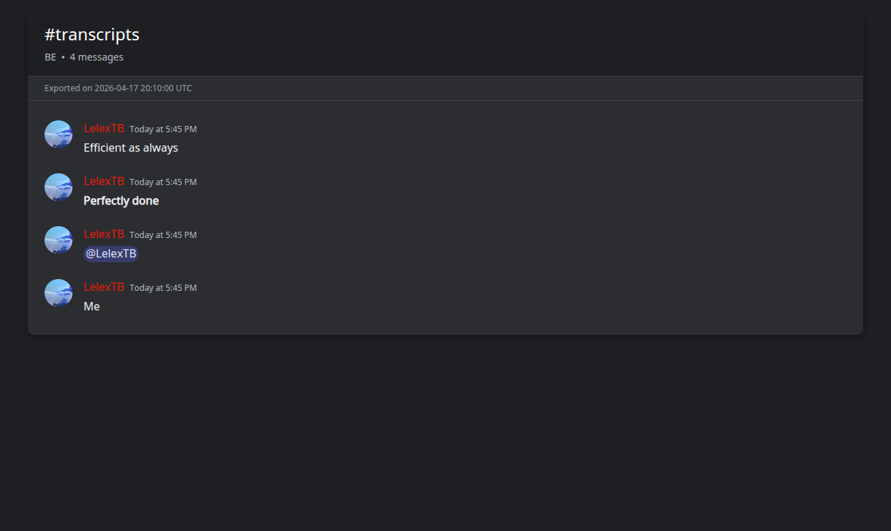
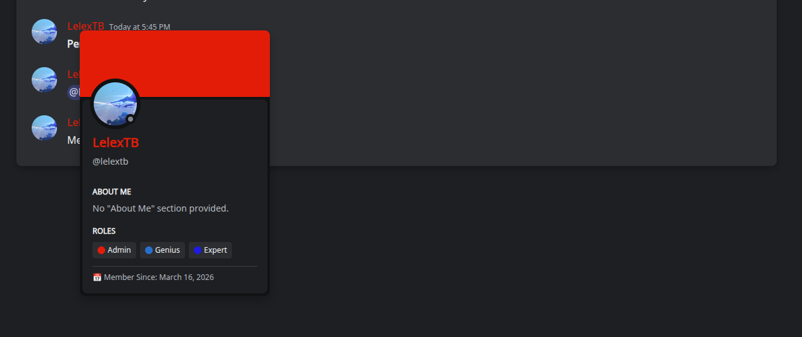

# 📜 Py-Discord-HTML-Transcripts

A production‑ready Python library for `discord.py` bots that exports complete Discord channel histories into authentic, interactive HTML transcripts.

[](https://python.org)
[](LICENSE)

## ✨ Features

- **🎨 Authentic Discord Style** – Dark theme, embeds, buttons, custom emojis, and markdown.
- **🖱️ Interactive Profiles** – Click any user to see a tooltip with banner, badges, roles, and "About Me".
- **⚡ Efficient & Resilient** – Adaptive rate‑limiting, user data caching, async I/O.
- **🔗 Smart Mentions** – Resolves user, role, and channel IDs to display names.
- **🛡️ Production‑Ready** – Full error handling and fallbacks.

## 📸 Preview


*Example transcript output*


*Clickable user profile tooltip*

## 📦 Installation

```bash
pip install py-discord-html-transcripts
```

## 🚀 Quick Start

1. Copy `.env.example` to `.env` and fill in your bot token and server ID.
2. Run `./setup.sh` (Linux/macOS) or `setup.bat` (Windows).
3. Invoke `/transcript` in any text channel.

## ⚙️ Configuration

| Variable | Description |
|----------|-------------|
| `DISCORD_TOKEN` | Your bot token |
| `SERVER_ID` | Guild ID for command sync |
| `TRANSCRIPT_DIR` | Output folder (default: `transcripts`) |
| `MAX_MESSAGES` | 0 = unlimited |
| `QUEST_BADGE_PATH` | Local path to quest badge icon |

## 🤝 Contributing

Issues and pull requests are welcome.

## 📄 License

GNU General Public License v3.0

---
Made with ❤️ by [alexwakrod](https://github.com/alexwakrod)
